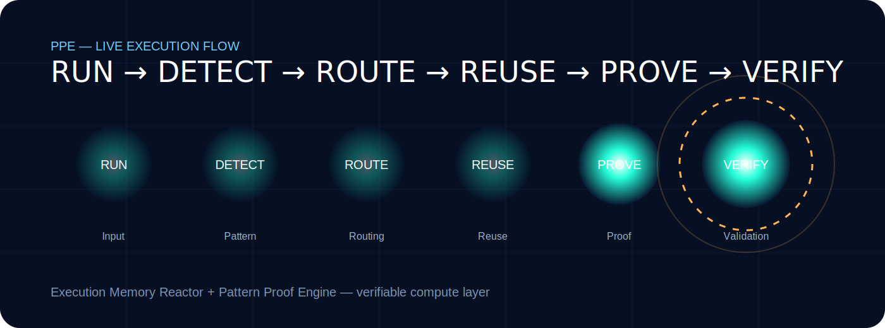

<p align="center">
  
</p>

<h1 align="center">⚡ M-OS MEE + PPE — Execution Memory Reactor</h1>

<p align="center">
<b>Consequence-Aware Execution Engine</b><br>
Pattern Memory • Signature Routing • Reuse Proof • Verification Layer
</p>

<p align="center">


</p>

---

# 🧠 What is M-OS MEE?

M-OS MEE explores a simple thesis:

```text
Execution does not always need to begin from zero.

Instead of recomputing everything:

✔ Detect patterns
✔ Recognize prior structures
✔ Route reusable paths
✔ Activate memory-backed execution
✔ Produce measurable proof

Core chain:

RUN → DETECT → ROUTE → REUSE → PROVE
⚡ Why It Matters

Modern systems repeatedly process structurally similar workloads.

Most still treat:

Every run as new
Every task as fresh compute
Every decision as isolated

M-OS MEE tests a different path:

Traditional Runtime	M-OS MEE
Recompute	Reuse
Cache outputs	Remember structures
Optimize after	Route before
Runtime-only metrics	Reuse + Proof metrics
🌐 Visual Architecture
<p align="center">  </p>
INPUT
 ↓
SIGNATURE
 ↓
ROUTING
 ↓
MEMORY
 ↓
PROOF

Layers:

🧩 Signature Layer
🛣 Routing Layer
🧠 Memory Reactor
🌌 Pattern Map
📜 Proof Surface

🚀 Reactor Surface
<p align="center">  </p>

Shows:

Upload-aware routing
Pattern detection
Route promotion
Reuse activation
Proof-state transitions
📊 Benchmark Evidence (PRC-2)
<p align="center">  </p>

Evidence pack includes:

Routing benchmark
Signature recall metrics
Persistence trials
Failure cases
Reuse metrics dataset
Sample Signals
Signal	Value
Reuse Match	88–91%
Saved Time	4960 ms
Recall	Stable
Confidence	High

Bounded proof model:

Cold Run
Warm Match
Reused Path
Saved Time
Proof Surface
🧬 Core Hypothesis
Attack ≠ Loss

Likewise —

Execution ≠ Always New

Patterns can be remembered.
🔶 PPE — Pattern Proof Engine

PPE extends MEE beyond proof generation into verifiable execution.

PROVE → VERIFY

Instead of stopping at proof:

Generate execution evidence
Bind execution to verifiable output
Enable independent validation
Transform proof → trust
⚡ Why PPE Exists

MEE proves execution internally.

PPE ensures:

proof can be exported
proof can be validated externally
proof can be trusted independently

Without PPE:

Proof = internal signal

With PPE:

Proof = verifiable artifact
🌐 PPE Flow Extension
<p align="center">  </p>

Extended chain:

RUN → DETECT → ROUTE → REUSE → PROVE → VERIFY

Additional layers:

📜 Evidence Engine
🔐 Verification Layer
🌍 External Validator

🚀 Unified System (MEE + PPE)
<p align="center">  </p>

System becomes:

MEE → execution intelligence
PPE → execution trust layer

Combined:

Execution → Proof → Verification
📦 Proof & Verification Output

PPE generates:

proof reports
execution logs
signature traces
verification results

Output:

docs/proof_reports/
🗂 Repository Structure
mos-mee-execution-reactor/

├── backend/
├── frontend/

├── benchmarks/
│  ├── benchmark_results.svg
│  ├── routing_benchmark.md
│  ├── reuse_metrics.csv
│  ├── signature_recall.md
│  ├── persistence_trials.md
│  └── failure_cases.md

├── docs/
│  ├── banner.svg
│  ├── architecture.gif
│  ├── mos_mee_demo_prc1.gif
│  ├── ppe/
│  │   ├── ppe-banner.svg
│  │   ├── ppe-architecture.svg
│  │   └── mos-mee-ppe-hero.svg
│  └── MOS_MEE_Project_Brief.docx

├── tools/
│  └── verifier/

└── README.md
⚙ Quick Run
Frontend
cd frontend
npm install
npm run dev
Backend
cd backend
python app.py
🔬 Position in M-OS Lineage
M-OS Runtime
   ↓
Pattern Graph / PSTG
   ↓
CRS / Parameter Golf
   ↓
M-OS MEE
   ↓
MEE + PPE

Focus shift:

MEE → execution memory
PPE → execution verification
❌ What This Is Not

Not:

OS replacement
Production scheduler
Compute kernel
Benchmark claim against production systems
✅ What This Is

✔ Experimental runtime layer
✔ Pattern-memory execution system
✔ Proof-driven execution engine
✔ Verification-enabled compute model
✔ Research surface for execution intelligence

📄 Research Brief
docs/MOS_MEE_Project_Brief.docx
👤 Author

Raaj Mandale
https://github.com/raajmandale

✔ PRC Status
 PRC-1 Reactor Surface
 Demo Proof Loop
 Benchmark Layer
 PPE Integration

Next:

PRC-3 → External Verification
License

MIT


---

# 🧠 Mandale-OS "M-OS"
