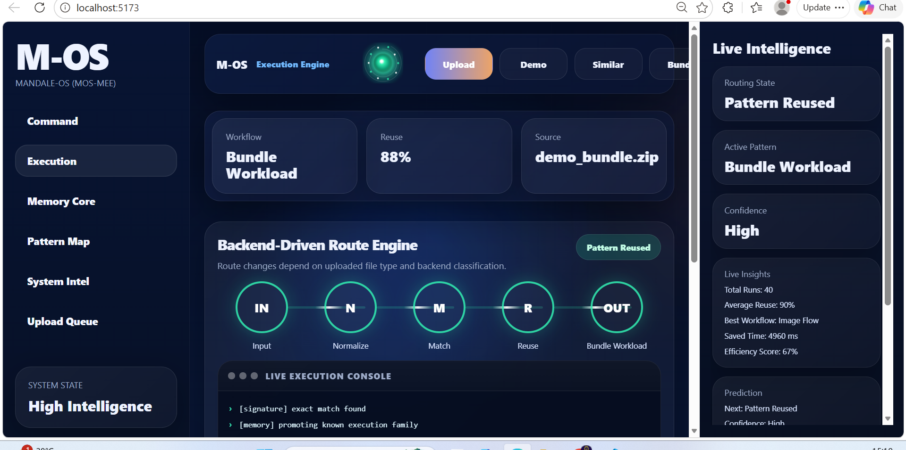
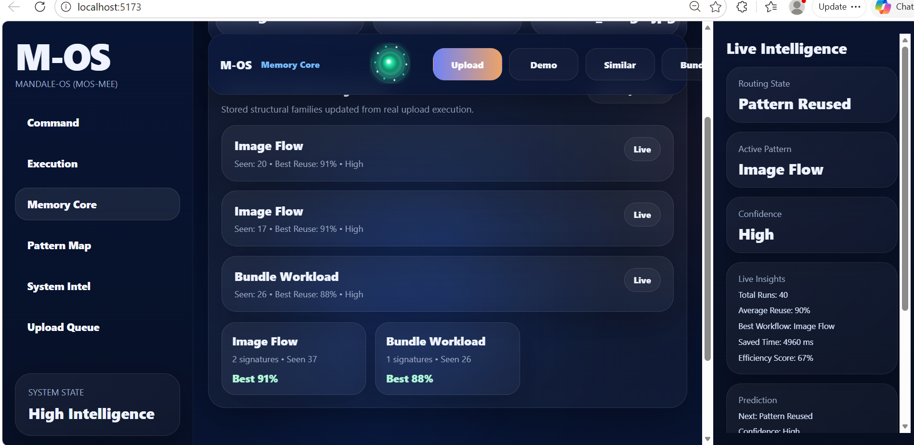
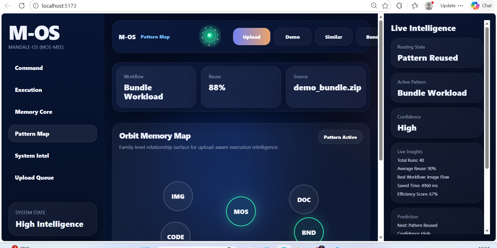
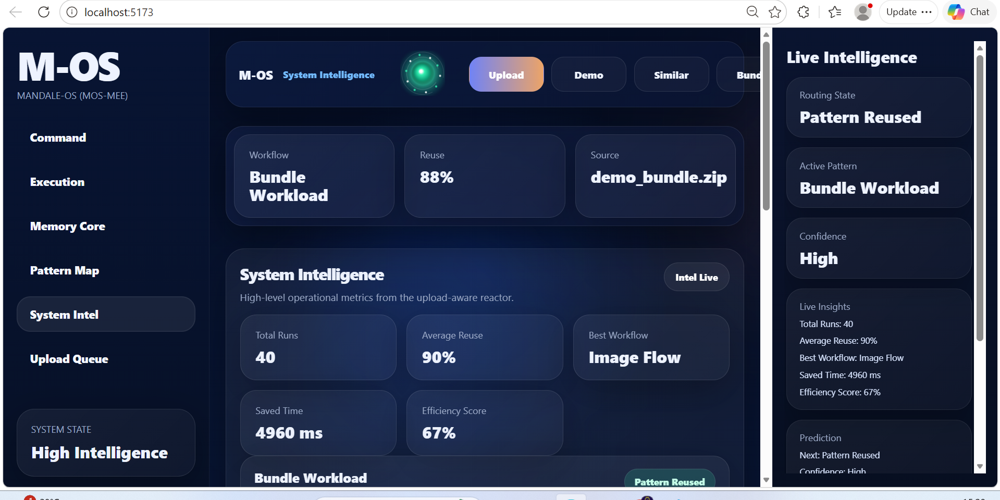
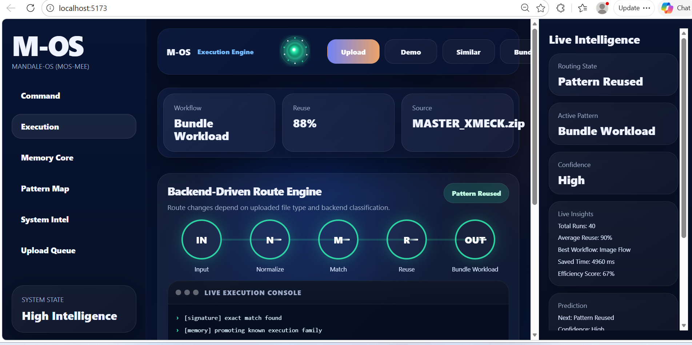

<p align="center">
  
</p>

<h1 align="center">M-OS MEE</h1>

<p align="center">
<b>Execution Memory Reactor for Reuse-Aware Compute</b><br>
Pattern detection, adaptive routing, and bounded execution reuse proof
</p>

<p align="center">


</p>

---

# What is M-OS MEE

M-OS MEE (Execution Memory Reactor) explores a simple question:

Can repeated workloads be recognized, routed, and partially reused rather than fully recomputed?

Traditional systems:

RUN → FINISH → DISCARD

M-OS MEE explores:

RUN → DETECT → ROUTE → REUSE → IMPROVE

This repository is a working prototype exploring that proposition.

---

# Why This Matters

Modern workloads frequently repeat structure.

Examples:

- recurring transforms  
- repeated file-family tasks  
- similar analysis paths  
- bundled workloads

Most systems recompute.

This prototype explores whether some repeated work may be reduced.

Potential signals explored:

✔ structural recall  
✔ route promotion  
✔ bounded reuse  
✔ measurable savings

---

# 60-Second Quickstart

Clone

```bash
git clone https://github.com/raajmandale/mos-mee-execution-reactor.git
cd mos-mee-execution-reactor
```

Backend

```bash
cd backend
python main.py
```

Frontend

```bash
cd frontend
npm install
npm run dev
```

Or:

```bash
run.bat
```

---

# Architecture

<p align="center">

</p>

| Layer | Responsibility |
|------|----------------|
| Signature Engine | structural detection |
| Route Engine | adaptive routing |
| Reactor | reuse decision |
| Memory Core | family persistence |
| Proof Surface | evidence display |

---

# Proof Route Model

```text
IN → N → M → R → OUT

IN   Input
N    Normalize
M    Match
R    Reuse
OUT  Routed Result
```

---

# Demo Surface

## Execution Reactor

<p align="center">

</p>

---

## Memory Core

<p align="center">

</p>

---

## Pattern Map

<p align="center">

</p>

---

## System Intelligence

<p align="center">

</p>

---

## Upload Queue

<p align="center">

</p>

---

# Demo GIF

<p align="center">

</p>

---

# Example Proof States

Cold

182 ms

Reuse 0%

---

Warm

108 ms

Reuse 42%

---

Reused

61 ms

Reuse 67%

Saved:

121 ms

Illustrative bounded prototype evidence only.

---

# Project Structure

```text
mos-mee-execution-reactor/

├ backend/
├ frontend/
├ demos/

├ docs/
│  ├ screenshots/
│  ├ architecture.gif
│  ├ mos_mee_demo_prc1.gif
│  ├ MOS_MEE_Project_Brief.docx
│  └ proof-mode.md

├ README.md
├ run.bat
└ run.sh
```

---

# Scope Boundary

This is:

- experimental prototype  
- research artifact  
- execution memory proof surface

This is NOT:

- OS replacement  
- benchmark superiority claim  
- production scheduler  
- universal optimization claim

Bounded scope intentionally.

---

# Documentation

Project Brief:

```text
docs/MOS_MEE_Project_Brief.docx
```

Proof Framing:

```text
docs/proof-mode.md
```

---

# Roadmap

Current

PRC-1 — proof reactor

Next

PRC-2 — benchmark surface  
PRC-3 — replayable proof mode  
PRC-4 — repeatability experiments

---
## M-OS Program Repositories

- M-OS Runtime (Foundational Runtime Proof)
- M-OS Parameter Golf (Efficiency Research Branch)
- M-OS MEE Execution Reactor (Operational Proof)

# Status

Prototype active.

PRC-1 packaging complete.

---

# Author

Raaj Mandale  
Founder — ERANEST / XMECK

---

# License

MIT

---

# Citation

```bibtex
@software{mandale_mos_mee_2026,
author={Raaj Mandale},
title={M-OS MEE: Execution Memory Reactor},
year={2026},
version={PRC1}
}
```