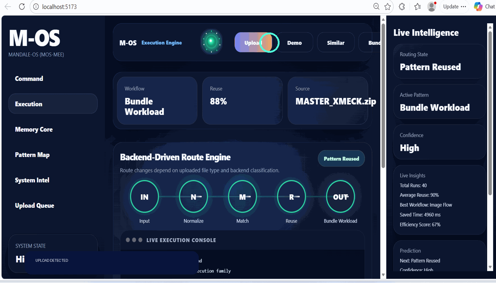
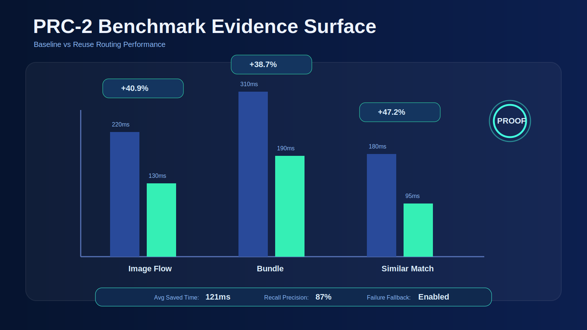

<p align="center">
  
</p>

<h1 align="center">⚡ M-OS MEE — Execution Memory Reactor</h1>

<p align="center">
<b>Consequence-Aware Execution Engine</b><br>
Pattern Memory • Signature Routing • Reuse Proof • Execution Intelligence
</p>

<p align="center">


</p>

---

# 🧠 What is M-OS MEE?

M-OS MEE explores a simple thesis:

```text
Execution does not always need to begin from zero.
```

Instead of recomputing everything:

✔ Detect patterns  
✔ Recognize prior structures  
✔ Route reusable paths  
✔ Activate memory-backed execution  
✔ Produce measurable proof

Core chain:

```text
RUN → DETECT → ROUTE → REUSE → PROVE
```

---

# ⚡ Why It Matters

Modern systems repeatedly process structurally similar workloads.

Most still treat:

- Every run as new  
- Every task as fresh compute  
- Every decision as isolated

M-OS MEE tests a different path:

| Traditional Runtime | M-OS MEE |
|---|---|
| Recompute | Reuse |
| Cache outputs | Remember structures |
| Optimize after | Route before |
| Runtime-only metrics | Reuse + Proof metrics |

---

# 🌐 Visual Architecture

<p align="center">

</p>

```text
INPUT
 ↓
SIGNATURE
 ↓
ROUTING
 ↓
MEMORY
 ↓
PROOF
```

Layers:

🧩 Signature Layer  
🛣 Routing Layer  
🧠 Memory Reactor  
🌌 Pattern Map  
📜 Proof Surface

---

# 🚀 Reactor Surface

<p align="center">

</p>

Shows:

- Upload-aware routing  
- Pattern detection  
- Route promotion  
- Reuse activation  
- Proof-state transitions

---

# 📊 Benchmark Evidence (PRC-2)

<p align="center">

</p>

Evidence pack includes:

- Routing benchmark  
- Signature recall metrics  
- Persistence trials  
- Failure cases  
- Reuse metrics dataset

### Sample Signals

| Signal | Value |
|---|---|
| Reuse Match | 88–91% |
| Saved Time | 4960 ms |
| Recall | Stable |
| Confidence | High |

Bounded proof model:

```text
Cold Run
Warm Match
Reused Path
Saved Time
Proof Surface
```

---

# 🧬 Core Hypothesis

```text
Attack ≠ Loss

Likewise —

Execution ≠ Always New

Patterns can be remembered.
```

---

# 🗂 Repository Structure

```text
mos-mee-execution-reactor/

├── backend/
├── frontend/

├── benchmarks/
│  ├── benchmark_results.svg
│  ├── routing_benchmark.md
│  ├── reuse_metrics.csv
│  ├── signature_recall.md
│  ├── persistence_trials.md
│  └── failure_cases.md

├── docs/
│  ├── banner.svg
│  ├── architecture.gif
│  ├── mos_mee_demo_prc1.gif
│  └── MOS_MEE_Project_Brief.docx

└── README.md
```

---

# ⚙ Quick Run

## Frontend

```bash
cd frontend
npm install
npm run dev
```

## Backend

```bash
cd backend
python app.py
```

---

# 🔬 Position in M-OS Lineage

```text
M-OS Runtime
   ↓
Pattern Graph / PSTG
   ↓
CRS / Parameter Golf
   ↓
M-OS MEE
```

Focus shift:

- M-OS Runtime → pattern execution  
- M-OS MEE → execution memory + reuse proof

---

# ❌ What This Is Not

Not:

- OS replacement  
- Production scheduler  
- Compute kernel  
- Performance claim against production systems

---

# ✅ What This Is

This is:

✔ Experimental runtime layer  
✔ Pattern-memory reactor  
✔ Proof-oriented execution surface  
✔ Reuse benchmark pack  
✔ Execution intelligence research

---

# 📄 Research Brief

See:

```text
docs/MOS_MEE_Project_Brief.docx
```

Contains:

- Architecture summary  
- Reactor model  
- PRC notes  
- Packaging brief

---

# 👤 Author

**Raaj Mandale**  
Founder — Eranest Technoware

Research:

- M-OS  
- XPADI  
- UNI-OS  
- QBAIX

GitHub:

https://github.com/raajmandale

---

# ✔ PRC Status

- [x] PRC-1 Reactor Surface  
- [x] Demo Proof Loop  
- [x] Benchmark Layer  
- [x] Packaging Brief  

Next:

```text
PRC-3 → Repeatability Trials
```

---

## License

MIT