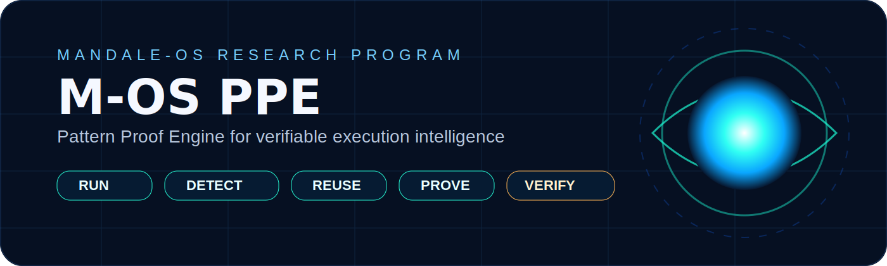
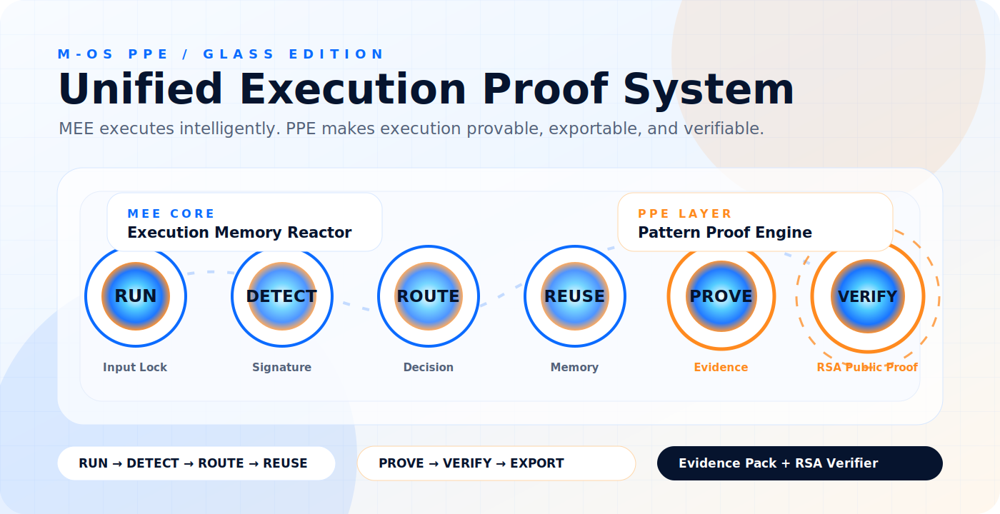

  

# ⚡ M-OS MEE + PPE  
### Execution Memory Reactor + Pattern Proof Engine  
**Run • Detect • Route • Reuse • Prove • Verify**

  
  
  
  
  

---

# 🧠 What is M-OS MEE?

M-OS MEE explores a simple thesis:

> Execution does not always need to begin from zero.

Instead of recomputing everything:

- Detect patterns  
- Recognize prior structures  
- Route reusable paths  
- Activate memory-backed execution  
- Produce measurable proof  

**Core chain:**  
`RUN → DETECT → ROUTE → REUSE → PROVE`

---

# ⚡ Why It Matters

Modern systems repeatedly process structurally similar workloads.

MEE enables:

- Reduced recomputation  
- Faster execution  
- Pattern reuse intelligence  
- Deterministic execution paths  

---

# 🧩 Layer Architecture

### 🔷 MEE Core (Execution Memory Reactor)

Handles execution intelligence:

| Stage  | Engine            | Purpose                         |
|--------|------------------|---------------------------------|
| RUN    | Runtime Layer     | Accept input                    |
| DETECT | Signature Engine  | Extract structure               |
| ROUTE  | Decision Engine   | Choose execution path           |
| REUSE  | Memory Reactor    | Apply prior computation         |

---

### 🟠 PPE Layer (Pattern Proof Engine)

Extends MEE with trust + validation:

| Stage  | Engine           | Purpose                         |
|--------|-----------------|---------------------------------|
| PROVE  | Evidence Engine | Generate execution proof        |
| VERIFY | RSA Verifier    | Validate output independently   |

---

# 🌐 Unified System Flow

  

**Flow:**

INPUT  
↓  
SIGNATURE  
↓  
ROUTING  
↓  
MEMORY  
↓  
PROOF  
↓  
VERIFICATION  

---

# ⚠️ What This is NOT

- Not an OS replacement  
- Not a scheduler  
- Not a kernel  
- Not a production system  

---

# ✅ What This IS

- Execution intelligence layer  
- Pattern-aware compute system  
- Memory-driven execution model  
- Proof-based computation engine  
- Verifiable execution pipeline  

---

# 🧬 Core Hypothesis

- Attack ≠ Loss  
- Execution ≠ Always New  
- Patterns can be remembered  

---

# 🧪 Bounded Proof Model

- Cold Run  
- Warm Match  
- Reused Path  
- Saved Time  
- Proof Surface  

---

# 📂 Repository Structure

mos-mee-execution-reactor/
├── backend/
├── frontend/
├── benchmarks/
├── docs/
│ ├── ppe/
│ │ ├── mos-mee-ppe-hero.svg
│ │ ├── ppe-architecture.svg
│ │ └── README.md
│ └── mos_mee_demo_prc1.gif
├── tools/
│ └── verifier/
├── README.md

---

# ⚙️ Quick Run

### Frontend

cd frontend
npm install
npm run dev

### Backend

cd backend
python app.py

---

# 🔬 Position in M-OS Lineage

M-OS Runtime  
↓  
Pattern Graph / PSTG  
↓  
CRS / Parameter Golf  
↓  
M-OS MEE  
↓  
**PPE (Proof Layer)**  

---

# 📊 PRC Status

- PRC-1 Reactor Surface  
- Demo Proof Loop  
- Benchmark Layer  
- Packaging Brief  

**Next:**  
PRC-3 → Repeatability Trials  

---

# 👤 Author

**Raaj Mandale**  
Founder — Eranest Technoware Pvt Ltd  

GitHub:  
https://github.com/raajmandale  

---

# 📜 License

MIT